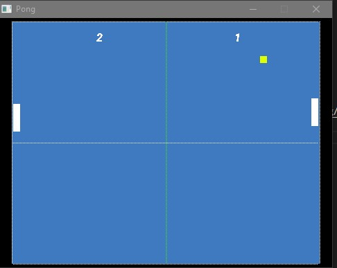
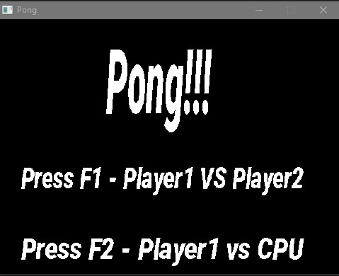

# CPPND: Capstone Pong Game

This is a simple Pong game cloned, created for the final project of the C++ nanodegree with udacity.

The project was create for show some techniques learned during the course.
In this project, the user can choose to play agains a second player or against the computer: the computer uses a simple AI, it just follow the ball with a small delay a the
beginning, for simulate the human reaction time that is 0.25s to visual stimulus.
It's been used SDL2 for the rendering of the object on the screen in addition to SDL2_TTF for the font and SDL2_Mixer for the sound effects.

## Dependencies for Running Locally
* cmake >= 3.7
  * All OSes: [click here for installation instructions](https://cmake.org/install/)
* make >= 4.1 (Linux, Mac), 3.81 (Windows)
  * Linux: make is installed by default on most Linux distros
  * Mac: [install Xcode command line tools to get make](https://developer.apple.com/xcode/features/)
  * Windows: [Click here for installation instructions](http://gnuwin32.sourceforge.net/packages/make.htm)
* SDL2 >= 2.0 / SDL2_TTF / SDL2_Mixer
  * All installation instructions can be found [here](https://wiki.libsdl.org/Installation)
  * Download link for [SDL2_TTF](https://www.libsdl.org/projects/SDL_ttf/) [SDL2_Mixer](https://www.libsdl.org/projects/SDL_mixer/)
  * Note that for Linux, an `apt` or `apt-get` installation is preferred to building from source.
  * Note for Windows: added the flags -mwindows -mconsole for make cout and printf visible in the console
* gcc/g++ >= 5.4
  * Linux: gcc / g++ is installed by default on most Linux distros
  * Mac: same deal as make - [install Xcode command line tools](https://developer.apple.com/xcode/features/)
  * Windows: recommend using [MinGW](http://www.mingw.org/)

## Basic Build Instructions

1. Clone this repo.
2. Make a build directory in the top level directory: `mkdir build && cd build`
3. Compile: `cmake .. && make`
4. Run it: `./SnakeGame`.

## Starting the game

Choose between play against a second player (pressing F1) or against the computer (pressing F2)

## Controls

Player 1 -> Move up: W     Move down: S
Player 2 -> Move up: ↑     Move down: ↓

## Rubric Points implemented
Below are the rubric points that are addressed/implemented in this project.

### README 
* All points
### Compiling and Testing 
* All points
### Loops, Functions, I/O
* The project demonstrates an understanding of C++ functions and control structures.
* The project accepts user input and processes the input. (main menu option and paddle movement control)
###Object Oriented Programming
* The project uses Object Oriented Programming techniques.
* Classes use appropriate access specifiers for class members.
* Class constructors utilize member initialization lists.
* Classes encapsulate behavior.
* Overloaded functions allow the same function to operate on different parameters.
### Memory Management
* The project makes use of references in function declarations.
* The project uses destructors appropriately. (see renderer destructors)
* The project uses smart pointers instead of raw pointers. (see main.cpp for the main menu render thread)
### Concurrency
* The project uses multithreading. (main menu started in a different thread)